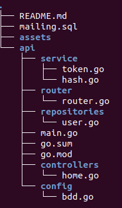

# Creation of API using JWT

Technologies used :
- Golang
- JWT

## Set up project

- Go in api folder
- Go in main.go file
- Check config in api/config
- Create mailing database
- Import mailing.sql file in mailing database

## Run api doc
```sh
$ cd api
$ swagger serve ./docs/swagger.yml
```

**Run api**
```sh
$ cd api
$ go run main.go
```

## Project architecture


- config allow you to manage project (database connexion)
- router contains all routes
- controllers is **JUST** function called in router
- service allow you to make operations like token generation, hash ...
- repositories allow you to make operation with database (GET, POST, PUT, DELETE ...)

Tutorial for authentification : https://www.youtube.com/watch?v=-Scg9INymBs&t=906s
Tutorial for database : https://tutorialedge.net/golang/golang-mysql-tutorial/
Tutorial for hash : https://www.alexedwards.net/blog/how-to-hash-and-verify-passwords-with-argon2-in-go